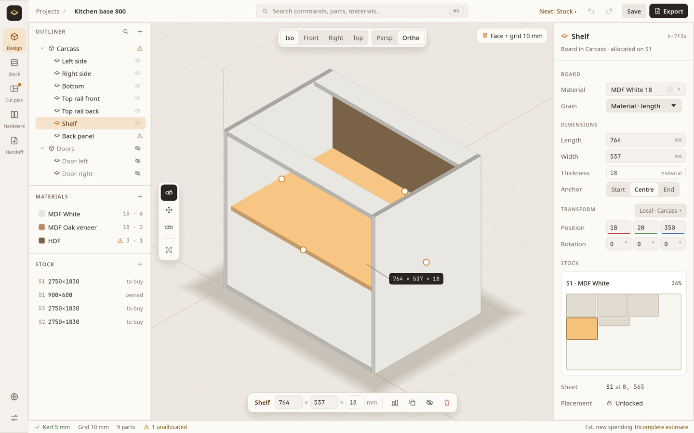
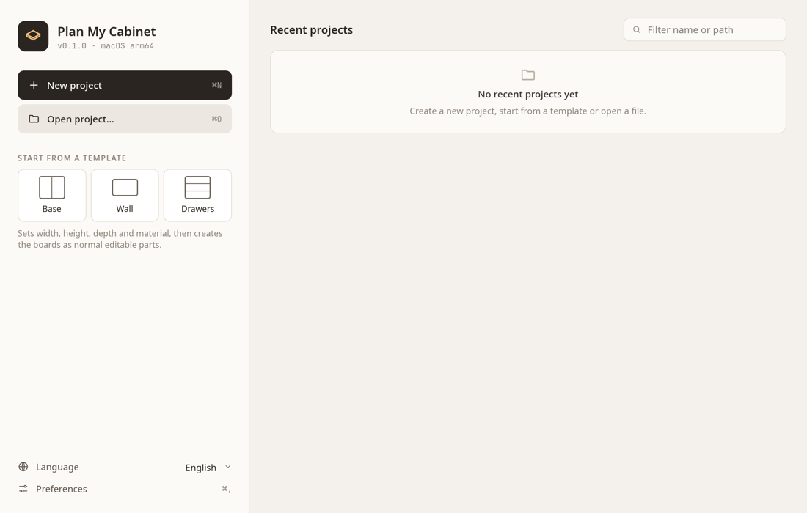
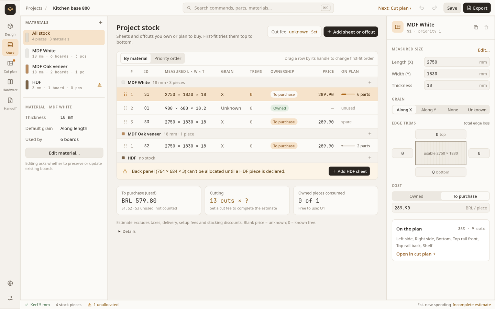
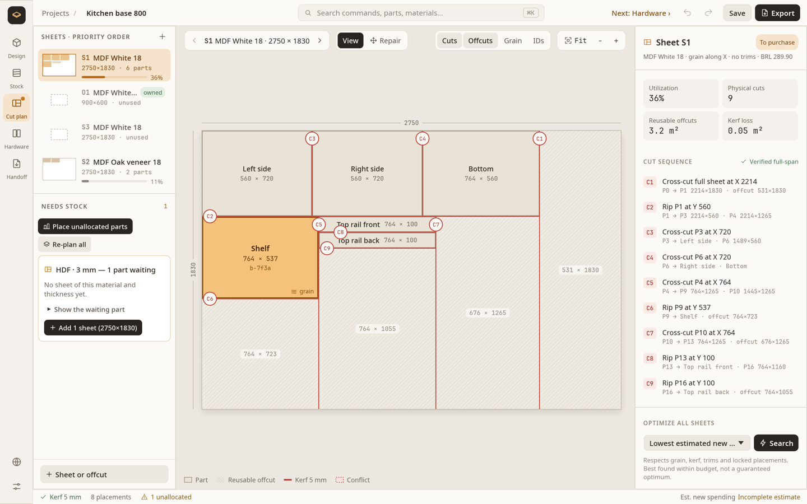
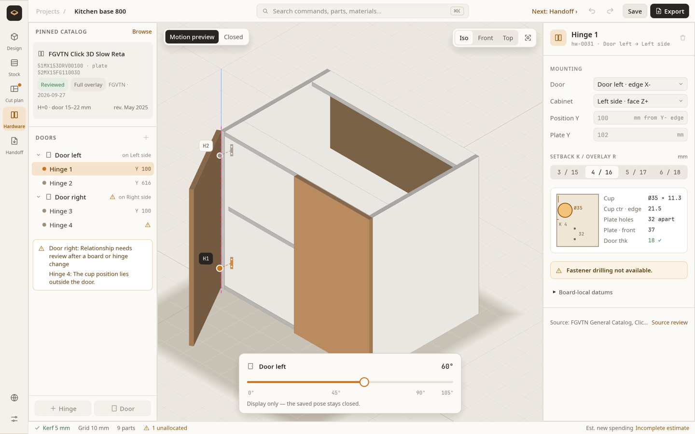
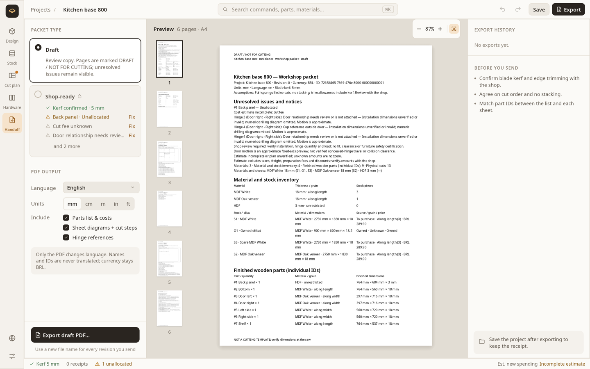

# Plan My Cabinet

Plan My Cabinet is a desktop app for designing cabinets and furniture from
sheet goods (MDF, plywood, veneered panels). You draw the boards in 3D, tell
the app which sheets you have or plan to buy, and it works out how to cut
them. You also get the hinge positions and a PDF packet you can take to the
shop.

It runs fully offline. Projects are single files on your computer, and no
account is needed. The interface is available in English and Brazilian
Portuguese.



## Install

**macOS and Linux**: paste this into a terminal:

```sh
curl -fsSL https://raw.githubusercontent.com/killertux/plan-my-cabinet/master/install.sh | sh
```

- On macOS the app goes to `~/Applications/Plan My Cabinet.app`.
- On Linux the program goes to `~/.local/bin/plan-my-cabinet`, with a menu
  entry.
- To install a specific version, set `PMC_VERSION=v0.1.0` before `sh`.

**Windows**: paste this into PowerShell:

```powershell
irm https://raw.githubusercontent.com/killertux/plan-my-cabinet/master/install.ps1 | iex
```

The app is installed under `%LOCALAPPDATA%\Programs\PlanMyCabinet` and
added to the Start menu.

**Manual download**: every release on the
[Releases page](https://github.com/killertux/plan-my-cabinet/releases) has
a package for each system, plus a `SHA256SUMS` file to check them:

| System | File |
|---|---|
| macOS, Apple Silicon | `plan-my-cabinet-<version>-macos-arm64.tar.gz` |
| macOS, Intel | `plan-my-cabinet-<version>-macos-x86_64.tar.gz` |
| Linux x86_64 | `plan-my-cabinet-<version>-linux-x86_64.tar.gz` |
| Windows x86_64 | `plan-my-cabinet-<version>-windows-x86_64.zip` |

> [!NOTE]
> The builds are not signed by Apple or Microsoft. If you downloaded the
> package with a browser, macOS may say the app "cannot be opened". In that
> case, right-click the app, choose **Open**, then confirm. Windows
> SmartScreen may show "Windows protected your PC"; click **More info →
> Run anyway**. Installing with the script above avoids the macOS warning.

**What you need**: a graphics card with Metal (macOS), Vulkan (Linux), or
Direct3D 12 / Vulkan (Windows). On Linux you also need an X11 or Wayland
desktop session.

## How to use it

The app follows a simple left-to-right flow. The rail on the left takes you
through five workspaces, in the order you normally use them:

**Design → Stock → Cut plan → Hardware → Handoff**

The **Next ›** link in the top-right corner always points to the next step.

### 1. Start a project



The quickest way to start is from a **template**:

- **Base**: a kitchen base cabinet.
- **Wall**: a wall cabinet with a shelf.
- **Drawers**: a drawer stack with boxes and fronts.

Pick one and the setup asks for:

- the overall width, height and depth;
- your units and currency;
- the materials, for example "MDF White 18 mm" and "HDF 3 mm" for the back.

Leave **Add the sheets this cabinet needs** checked. The app then adds
enough standard sheets of each material to buy, and places every board on
them. You get a complete cut plan straight away.

The template creates ordinary boards. After that, you can change anything by
hand.

You can also start with **New project**, which asks for the project's name,
currency and units, and add boards yourself. To rename a project later, click
its name at the top of the window and choose **Rename project…**.

### 2. Design the boards

In **Design**, every board is a rectangle with a length, width and thickness.

- **Select a board**: click it in the 3D view or in the **Outliner** on the
  left.
- **Change its size or position**: use the inspector on the right, or the
  bar under the view.
- **Resize by dragging**: drag the round handles on its faces.
- **Group boards**: put boards into assemblies (Carcass, Doors, …) to keep
  large projects tidy.

You can type sizes in any unit, whatever your project unit is:

- `600`, `60 cm`, `0.6 m`, `23 5/8 in` and `2'` all work.
- A comma works as a decimal point, so `18,5` is 18.5 mm.

Moving around the 3D view:

| Action | Mouse | Trackpad |
|---|---|---|
| Orbit | drag | click and drag |
| Pan | right-drag or Shift+drag | two-finger click and drag |
| Zoom | scroll | pinch |
| Frame selection | `F` | `F` |

The buttons at the top switch between Iso, Front, Right and Top views, and
between perspective and orthographic cameras.

### 3. Declare your stock



In **Stock**, list the sheets and offcuts you can cut from. For each one,
enter:

- its measured size;
- its grain direction;
- any edge trims;
- whether you already **own** it or will **buy** it, with a price.

The app fills sheets **from the top of the list down**. Drag rows to decide
which sheets to use first, for example leftovers before new sheets. Parts that
fit nowhere show up with a button that adds a sheet of the right material.

### 4. Check the cut plan



**Cut plan** shows each sheet with its parts, the numbered cut sequence and
the reusable offcuts. Every plan uses straight, full-length (guillotine) cuts,
the kind you make on a table saw or panel saw. The saw blade width (kerf) is
included in every cut.

- **Place unallocated parts** puts boards that have no sheet into the free
  space left on your sheets.
- **Re-plan all** repacks every board that is not locked, usually onto fewer
  sheets. It is one undo step, so you can try it freely.
- If some parts still don't fit, the **Needs stock** card for that material
  explains why, for example "no sheet of this material" or "part larger than
  any sheet". It also offers **Add N sheets** to fix it in one click.
- **Repair** lets you move parts on a sheet yourself and lock them in place.
- **Optimize all sheets** (bottom right) searches for the plan with the
  lowest new spending or the fewest cuts.

### 5. Place the hinges, slides and feet



In **Hardware**, you attach each door to its cabinet side and add hinges from
a catalog. For each hinge, the app shows where it goes: the cup position, the
mounting plate holes and the overlay for the setback you choose. You can also
preview the door opening. Drawers get catalog slides: the app checks the side
gaps, depth and height, gives the hole positions and previews the drawer
sliding out. Feet (plastic, chrome, industrial legs) are drawn with the
product's shape. The bundled catalogs contain FGVTN hinges and drawer slides,
taken from the manufacturer's data sheets, and generic feet.

### 6. Hand off to the shop



**Handoff** builds a PDF with the parts list, the costs, the sheet diagrams
with their cut steps, the hinge and slide references, and the hardware to buy.

- A **Draft** packet is marked "NOT FOR CUTTING" and lists any open issues.
- A **Shop-ready** packet requires every issue to be solved first.

Each export is recorded with the project, so you can tell later which
revision you sent.

### Handy shortcuts

Use **⌘** on macOS and **Ctrl** on Windows or Linux.

| Shortcut | Action |
|---|---|
| ⌘K | Search commands, boards, materials and sheets |
| ⌘1 … ⌘5 | Switch workspace |
| ⌘S | Save |
| ⌘Z / ⌘⇧Z | Undo / redo |
| ⌘, | Preferences (language, interface scale, units, kerf, costs) |

The app saves recovery snapshots while you work. If it closes unexpectedly,
the Welcome screen offers to restore your work.

## Use it from an AI agent

`plan-my-cabinet --mcp` runs a [Model Context Protocol](https://modelcontextprotocol.io)
server on standard input and output, with no window. An agent such as Claude
can then build a cabinet, look at pictures of it, plan the cuts, add hinges,
doors, drawer slides and feet, create new hardware models, and save a project
file you open in the app. For example, with
Claude Code:

```sh
claude mcp add plan-my-cabinet -- "$HOME/Applications/Plan My Cabinet.app/Contents/MacOS/plan-my-cabinet" --mcp
```

See [Using it from an AI agent](docs/mcp-en.md) for the setup on each system.

## More documentation

The `docs/` folder has a detailed guide for each area, in English and
Portuguese:

- [Boards and materials](docs/boards-en.md)
- [Assemblies](docs/assembly-en.md)
- [Measurement entry](docs/input-en.md)
- [3D view](docs/viewport-en.md)
- [Stock and cut planning](docs/stock-en.md)
- [Hinges, drawer slides, feet and catalog packs](docs/hardware-en.md)
- [Edge banding](docs/banding-en.md)
- [Coating and how sheets look](docs/coating-en.md)
- [Shop handoff](docs/shop-handoff-en.md)
- [Ordering parts through CorteCloud](docs/cortecloud-en.md)
- [Project files and recovery](docs/project-en.md)
- [Using it from an AI agent (MCP)](docs/mcp-en.md)

## Building from source

You need Rust 1.95 or newer.

```sh
git clone https://github.com/killertux/plan-my-cabinet.git
cd plan-my-cabinet
cargo run --release
```

To run the checks and tests:

```sh
cargo fmt --check
cargo clippy --locked --all-targets -- -D warnings
cargo test --locked
```

See [docs/development.md](docs/development.md) for platform notes and
packaging.

### Making a release

1. Bump `version` in `Cargo.toml` and commit.
2. Tag the commit with the same version, then push the tag:

   ```sh
   git tag v0.2.0
   git push origin v0.2.0
   ```

The [Release workflow](.github/workflows/release.yml) builds packages for
macOS (Apple Silicon and Intel), Linux and Windows. It then publishes them
as a GitHub release with a `SHA256SUMS` file, which is what the install
scripts download. If the tag doesn't match the version in `Cargo.toml`, the
workflow stops.
